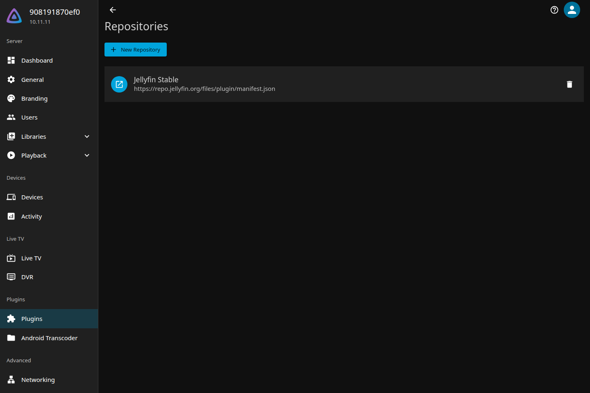
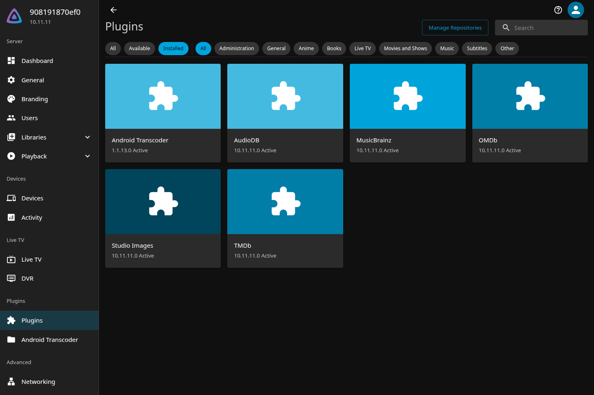

# Jellyfin Android Transcoder

Android MediaCodec transcode bridge for Jellyfin.

This repository contains the deployable Android worker app and Jellyfin plugin/shim. The patched FFmpeg source lives in a separate public fork, and the full Jellyfin + Android emulator validation lives in a separate integration repository.

Related repositories:

- Android worker + Jellyfin plugin: https://github.com/doctorpangloss/jellyfin-android-transcoder
- Patched FFmpeg fork: https://github.com/doctorpangloss/forks-ffmpeg-android
- Integration tests: https://github.com/doctorpangloss/jellyfin-android-transcoder-integration

## Install The Verified Release

Install `v1.1.13` in this order:

1. On the phone, install the [APK](https://github.com/doctorpangloss/jellyfin-android-transcoder/releases/latest/download/jellyfin-android-transcoder-1.1.13.apk), open **Android Transcoder**, and leave **Keep awake** on.
2. In Jellyfin, open **Dashboard -> Plugins -> Manage Repositories -> New Repository** and add:

   ```text
   https://github.com/doctorpangloss/jellyfin-android-transcoder/releases/latest/download/manifest.json
   ```

   

3. Return to **Plugins**, select **Available**, install **Android Transcoder**, and restart Jellyfin.
4. Open **Dashboard -> Plugins** and select **Android Transcoder** from the card or the sidebar entry.

   

5. On the phone, tap **Pair from QR**:

   

   Then scan the QR code on the Jellyfin plugin page:

   

6. In Jellyfin, click **Refresh status** and confirm **Connected**.

The phone and Jellyfin server must be able to reach each other. Manual pairing is available by copying the setup URL from the Android app into the plugin page.

## What It Does

Jellyfin still invokes an FFmpeg-shaped executable. The plugin installs `jfat-ffmpeg` as a shim, and the shim preserves Jellyfin's normal HLS output contract while routing eligible HEVC/AV1 video transcodes to an Android foreground service.

The Android service exposes:

- `GET /api/v1/status`
- `POST /api/v1/remoteprocesses`
- `DELETE /api/v1/remoteprocesses/{id}`

The remote process endpoint starts bundled patched FFmpeg, streams input into FFmpeg stdin or through a signed Jellyfin source URL, and streams completed HLS files or video-only MPEG-TS stdout back to the shim. Unsupported Jellyfin commands fall back to the configured real FFmpeg path.

## Benchmarks

The source is 4K HEVC 10-bit at approximately 60 Mbps. The destination is 1080p H.264 at 6 Mbps in Jellyfin HLS. RT rate is output duration divided by elapsed time; values above `1.0x` are real-time.

| Input | V1500B | Android MediaCodec on Pixel 10 |
| --- | ---: | ---: |
| SDR | 1.16x | 1.08x |
| HDR10 to SDR | 0.68x | 1.20x |

## Job Liveness

`GET /api/v1/status` returns `activeJobs`, `jobs`, `jobIdleTimeoutMillis`, and `jobMaxRuntimeMillis`. Each active job reports its id, age, idle time, input bytes, output file count, process state, and cancel reason.

The Android service automatically kills and reaps a job when:

- the FFmpeg process has exited but the service still has stale state
- the job has no input or output activity for 90 seconds
- the job runs for more than 30 minutes

To manually clear a stuck job:

```bash
JOB_ID=<id-from-status>
curl -X DELETE \
  -H "Authorization: Bearer <token>" \
  "http://PHONE_IP:8098/api/v1/remoteprocesses/$JOB_ID"
```

The endpoint returns `404` with `{"canceled":false,...}` if the job id no longer exists.

## Release Assets

The `v1.1.13` release publishes:

- `jellyfin-android-transcoder-1.1.13.apk`: direct sideload APK.
- `jellyfin-android-transcoder-1.1.13.aab`: Android App Bundle for bundletool/Play-style installs.
- `Jellyfin.Plugin.AndroidTranscoder-1.1.13.zip`: Jellyfin plugin zip.
- `manifest.json`: Jellyfin plugin repository manifest.
- `SHA256SUMS`: release checksums.

The Android artifact includes native FFmpeg payloads for `arm64-v8a`, `armeabi-v7a`, `x86`, and `x86_64`.

## Build Locally

Prerequisites:

- .NET SDK 9
- JDK 21
- Android SDK
- Android NDK r27d if rebuilding FFmpeg
- `zip`

Build patched FFmpeg payloads:

```bash
FFMPEG_SRC=/home/administrator/Documents/forks-ffmpeg-android \
ANDROID_NDK_ROOT=/home/administrator/android-ndk/android-ndk-r27d \
./scripts/build-android-ffmpeg.sh
```

Build release assets:

```bash
VERSION=1.1.13 ANDROID_HOME="$HOME/Android/Sdk" ./scripts/package-release.sh
```

Artifacts are written to `dist/`.

## Test

Component tests:

```bash
dotnet test JellyfinAndroidTranscoder.sln --nologo
cd android-transcoder
ANDROID_HOME="$HOME/Android/Sdk" ./gradlew :app:connectedVanillaAndroidTest
```

Full integration tests are in:

```text
https://github.com/doctorpangloss/jellyfin-android-transcoder-integration
```

They start Jellyfin via Testcontainers, start an Android emulator, install the app, install/configure the plugin, add a 1 GiB HEVC fixture, and fetch browser-visible HLS through Jellyfin.
