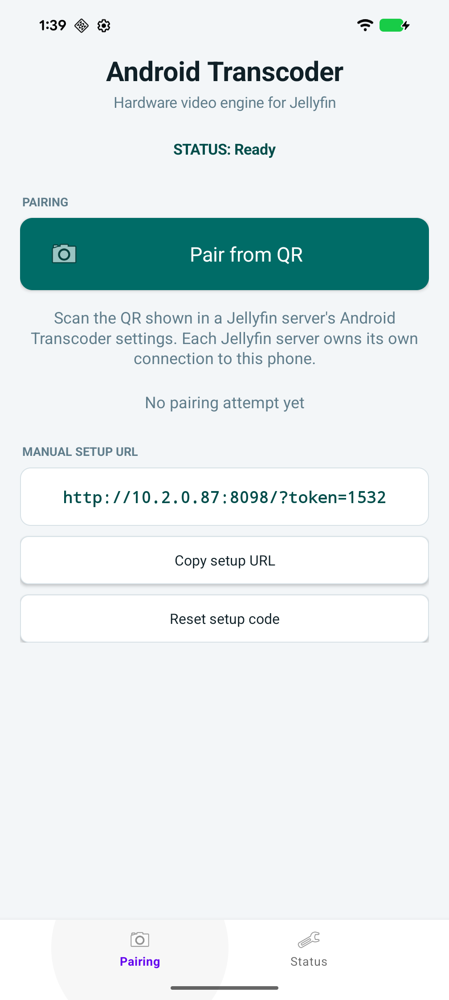
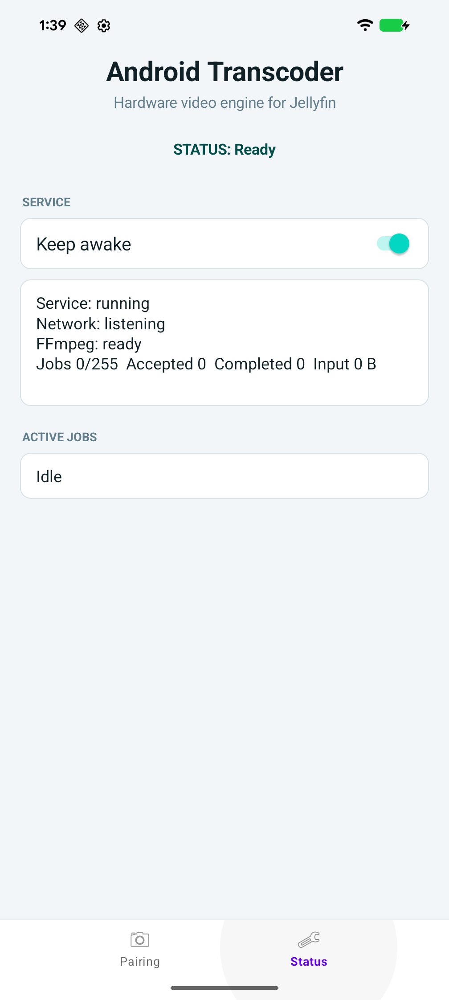
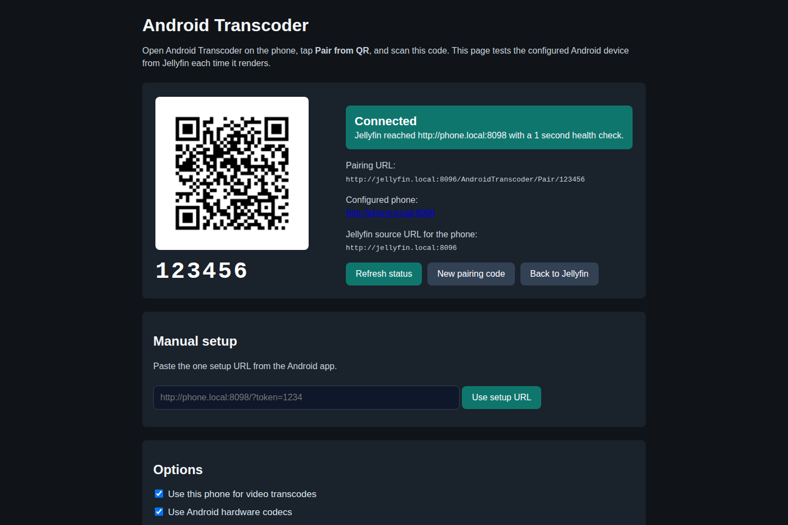

# Jellyfin Android Transcoder

Android MediaCodec transcode bridge for Jellyfin.

This repository contains the deployable Android worker app and Jellyfin plugin/shim. The patched FFmpeg source lives in a separate public fork, and the full Jellyfin + Android emulator validation lives in a separate integration repository.

Related repositories:

- Android worker + Jellyfin plugin: https://github.com/doctorpangloss/jellyfin-android-transcoder
- Patched FFmpeg fork: https://github.com/doctorpangloss/forks-ffmpeg-android
- Integration tests: https://github.com/doctorpangloss/jellyfin-android-transcoder-integration

## What It Does

Jellyfin still invokes an FFmpeg-shaped executable. The plugin installs `jfat-ffmpeg` as a shim, and the shim preserves Jellyfin's normal HLS output contract while routing eligible HEVC/AV1 video transcodes to an Android foreground service.

The Android service exposes:

- `GET /api/v1/status`
- `POST /api/v1/remoteprocesses`
- `DELETE /api/v1/remoteprocesses/{id}`

The remote process endpoint starts bundled patched FFmpeg, streams input into FFmpeg stdin or through a signed Jellyfin source URL, and streams completed HLS files or video-only MPEG-TS stdout back to the shim. Unsupported Jellyfin commands fall back to the configured real FFmpeg path.

## Benchmarks

Measured on June 30, 2026 with Jellyfin `10.11.6`, plugin/shim `1.1.11`, Jellyfin FFmpeg `7.1.3-Jellyfin`, and the Android worker running on a Pixel-class device with the bundled Android MediaCodec FFmpeg build. The Synology baseline is the AMD Ryzen Embedded V1500B running Jellyfin's software `libx264` path.

The input was a local 4K HEVC 10-bit remux sample. The benchmark command was Jellyfin-shaped HLS output at 1080p H.264, 6 Mbps, 3 second fMP4 segments, video only. RT rate is HLS media seconds produced divided by elapsed wall-clock seconds.

| Workload | Path | Window | Media produced | RT rate | Notes |
| --- | --- | ---: | ---: | ---: | --- |
| 4K HEVC10 SDR -> 1080p H.264 | V1500B software `libx264` | 25.835 s | 30 s | 1.16x | Real-time on this sample. |
| 4K HEVC10 SDR -> 1080p H.264 | Android MediaCodec | 25.069 s | 27 s | 1.08x | Real-time, but close to the V1500B because network/source/HLS overhead dominates. |
| 4K HEVC10 HDR10 -> 1080p H.264 SDR | V1500B software tone map + `libx264` | 61.546 s | 42 s | 0.68x | Not real-time; first HLS segment at 9.3 s. |
| 4K HEVC10 HDR10 -> 1080p H.264 SDR | Android MediaCodec + GLES surface tonemap | 60.043 s | 72 s | 1.20x | Real-time once started; first HLS segment at 15.6 s. |

Interpretation: the Android path is viable for SDR HEVC transcodes and can beat the V1500B software path for HDR10 tone-map work when it uses the video-only MPEG-TS stdout/remux path. Startup latency is still higher on the Android HDR path, and PGS/image subtitle burn-in is not accelerated by this release; avoid burn-in or use client-rendered/text subtitles for the Android path.

## Job Liveness

`GET /api/v1/status` returns `activeJobs`, `jobs`, `jobIdleTimeoutMillis`, and `jobMaxRuntimeMillis`. Each active job reports its id, age, idle time, input bytes, output file count, process state, and cancel reason.

The Android service automatically kills and reaps a job when:

- the FFmpeg process has exited but the service still has stale state
- the job has no input or output activity for 90 seconds
- the job runs for more than 30 minutes

To manually clear a stuck job:

```bash
JOB_ID=<id-from-status>
curl -X DELETE \
  -H "Authorization: Bearer <token>" \
  "http://PHONE_IP:8098/api/v1/remoteprocesses/$JOB_ID"
```

The endpoint returns `404` with `{"canceled":false,...}` if the job id no longer exists.

## Release Assets

The `v1.0.0` release publishes:

- `jellyfin-android-transcoder-1.0.0.apk`: direct sideload APK.
- `jellyfin-android-transcoder-1.0.0.aab`: Android App Bundle for bundletool/Play-style installs.
- `Jellyfin.Plugin.AndroidTranscoder-1.0.0.zip`: Jellyfin plugin zip.
- `manifest.json`: Jellyfin plugin repository manifest.
- `SHA256SUMS`: release checksums.

The Android artifact includes native FFmpeg payloads for `arm64-v8a`, `armeabi-v7a`, `x86`, and `x86_64`.

## Android Install

### Direct Phone Install

Download the APK on the Android phone. This is the file to install:

```text
https://github.com/doctorpangloss/jellyfin-android-transcoder/releases/latest/download/jellyfin-android-transcoder-1.0.0.apk
```

Scan this QR code on the phone to open the APK download:


After the APK downloads:

1. Open the downloaded `jellyfin-android-transcoder-1.0.0.apk` from the browser downloads list or the Android **Files** app.
2. If Android says the browser or Files app is not allowed to install unknown apps, tap **Settings** on that prompt.
3. Enable **Allow from this source** for the app you used to open the APK, such as Chrome, Firefox, GitHub, or Files.
4. Go back to the APK installer.
5. If Play Protect appears, expand **More details** if needed and choose **Install anyway** or **Continue**. A message like **Play Protect is already turned on** is not the final install confirmation.
6. Tap **Install**.
7. After installation, open **Android Transcoder**.
8. Leave **Keep awake** enabled. It is on by default so the phone keeps the CPU, screen, and Wi-Fi active while it is acting as Jellyfin's video engine.
9. Confirm Jellyfin can reach the phone by opening `http://PHONE_IP:8098/api/v1/status` from the Jellyfin server or container network.

If Android returns to the downloads screen without showing **App installed**, the APK was not installed. Reopen the APK and finish the prompts above.

ADB install:

```bash
adb install -r jellyfin-android-transcoder-1.0.0.apk
adb shell monkey -p com.hiddenswitch.androidtranscoder 1
```

Bundletool install from the AAB:

```bash
java -jar bundletool-all-1.18.3.jar build-apks \
  --bundle jellyfin-android-transcoder-1.0.0.aab \
  --output jellyfin-android-transcoder-1.0.0.apks \
  --mode universal \
  --overwrite

java -jar bundletool-all-1.18.3.jar install-apks \
  --apks jellyfin-android-transcoder-1.0.0.apks \
  --device-id <adb-device-id>
```

The app must be reachable from the Jellyfin container. On Tailscale, use the phone's Tailscale IP in the setup URL or Jellyfin plugin settings.

### Android App Screens

The **Pairing** tab shows one QR action and one copy/paste setup URL. Tap the URL itself or tap **Copy setup URL** to copy it to the clipboard. The token in the URL is a random four-digit setup code generated on first start. Use **Reset setup code** to rotate it.



The **Status** tab shows service state, whether keep-awake is enabled, and active job counters.



## Jellyfin Docker Compose Example

```yaml
services:
  jellyfin:
    image: jellyfin/jellyfin:10.11.6
    container_name: jellyfin
    network_mode: bridge
    extra_hosts:
      - "host.docker.internal:host-gateway"
    ports:
      - "8096:8096"
    volumes:
      - ./jellyfin-config:/config
      - ./jellyfin-cache:/cache
      - /path/to/media:/media:ro
    restart: unless-stopped
```

Install the plugin:

1. In Jellyfin, go to **Dashboard -> Plugins -> Repositories**.
2. Add the repository URL:

   ```text
   https://github.com/doctorpangloss/jellyfin-android-transcoder/releases/download/v1.0.0/manifest.json
   ```

3. Install **Android Transcoder** from the catalog, or manually unpack `Jellyfin.Plugin.AndroidTranscoder-1.0.0.zip` into:

   ```text
   ./jellyfin-config/plugins/Android Transcoder_1.0.0/
   ```

4. Restart Jellyfin.
5. Open **Dashboard -> Plugins -> Android Transcoder**. The embedded Jellyfin plugin page redirects to the live Android Transcoder page at `/AndroidTranscoder/Page`.
6. Open **Android Transcoder** on the phone.
7. Tap **Pair from QR**.
8. Scan the QR code shown by Jellyfin.
9. Click **Refresh status** in Jellyfin. The page should show **Connected**.
10. Leave **Use this phone for video transcodes** enabled.
11. Leave **Use Android hardware codecs** enabled unless you are debugging the software path.

The live plugin page tests the configured Android device from Jellyfin every time it renders, using a 1 second health check. If the phone cannot reach the QR URL, open Jellyfin using a URL the phone can visit and scan that QR code instead. If Jellyfin cannot reach the phone, use the phone's setup URL described below.



Manual setup, if QR pairing is not available:

1. In the Android app, tap **Copy setup URL**. It looks like:

   ```text
   http://PHONE_IP:8098/?token=1234
   ```

2. In Jellyfin, paste that one URL into **Manual setup**.
3. Click **Use setup URL**.
4. Click **Refresh status**.
5. Confirm the page shows **Connected** and the configured phone URL.

The plugin writes the shim to:

```text
/config/plugins/Jellyfin.Plugin.AndroidTranscoder/shim/jfat-ffmpeg
```

and writes shim config beside it as `shim-config.json`.

## Build Locally

Prerequisites:

- .NET SDK 9
- JDK 21
- Android SDK
- Android NDK r27d if rebuilding FFmpeg
- `zip`

Build patched FFmpeg payloads:

```bash
FFMPEG_SRC=/home/administrator/Documents/forks-ffmpeg-android \
ANDROID_NDK_ROOT=/home/administrator/android-ndk/android-ndk-r27d \
./scripts/build-android-ffmpeg.sh
```

Build release assets:

```bash
VERSION=1.0.0 ANDROID_HOME="$HOME/Android/Sdk" ./scripts/package-release.sh
```

Artifacts are written to `dist/`.

## Test

Component tests:

```bash
dotnet test JellyfinAndroidTranscoder.sln --nologo
cd android-transcoder
ANDROID_HOME="$HOME/Android/Sdk" ./gradlew :app:connectedVanillaAndroidTest
```

Full integration tests are in:

```text
https://github.com/doctorpangloss/jellyfin-android-transcoder-integration
```

They start Jellyfin via Testcontainers, start an Android emulator, install the app, install/configure the plugin, add a 1 GiB HEVC fixture, and fetch browser-visible HLS through Jellyfin.
